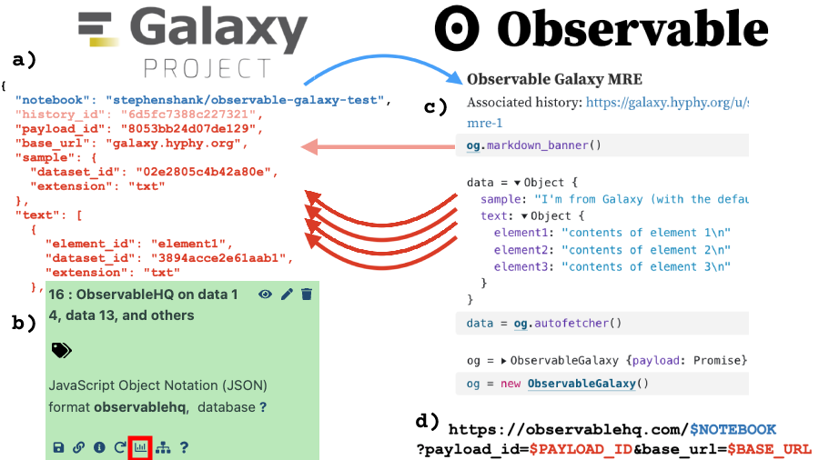

# The Observable Galaxy


Integrating the [ObservableHQ notebook platform](https://observablehq.com/) with [the Galaxy project](http://galaxyproject.org/).

Go to the [main Observable page](https://observablehq.com/@stephenshank/the-observable-galaxy) to get started. This repository contains the associated tool and display application for Galaxy.

## Installation

Install from [the test toolshed](https://testtoolshed.g2.bx.psu.edu/repository?repository_id=1a5732c8e4c561e3&changeset_revision=1c2fae461adc).

Enable [CORS](https://en.wikipedia.org/wiki/Cross-origin_resource_sharing).

Put `display/observable.xml` in `$GALAXY_ROOT/display_applications`.

Add

```
<datatype extension="observablehq" type="galaxy.datatypes.text:Json" mimetype="application/json" subclass="true" display_in_upload="false">
	<display file="observable.xml" />
</datatype>
```

to `$GALAXY_ROOT/config/datatypes_conf.xml`.

## Usage

See [this minimal reproducible example](https://observablehq.com/@stephenshank/observable-galaxy-mre).